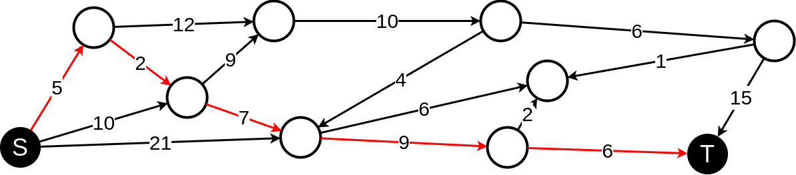

# Shortest Path Problem

<p align="center">
    
</p>

This project aims to solve the Shortest Path Problem using linear programming.

## Instances

The instances have this format:

```
P n m
A u_1 v_1 c(u_1, v_1)
[...]
A u_m v_m c(u_m, v_m)
T
```

Where:
- *n* is the number of vertices
- *m* is the number of edges
- *A u_j, v_j* represents the edge that starts in vertex *u_j* and ends in vertex *v_j* that has a *c(u_j, v_j)* cost
- *T* represents the end of the instance

You can see a instance example at <a href="./instances/example.in"> ./instances/example.in </a> file.

## Install dependencies

In the root directory of the repository run:

```bash
pip install -r requirements.txt
```

## How to run

In the root directory run in your terminal:

```bash
src/main.py <path_to_instance> <start_point_index> <end_point_index>
```

The result is going to be printed in the terminal. A .lp and .sol files will be created in output directory with more details of the execution.